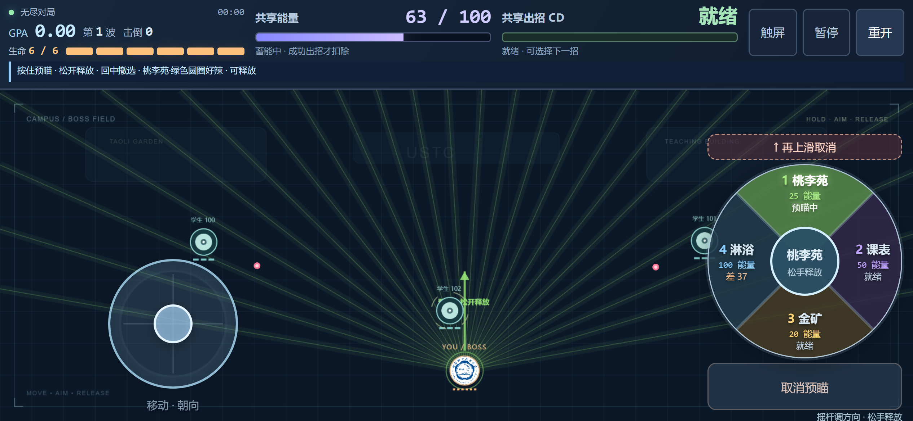

# 科大弹幕录：绩点保卫战

玩家控制 Boss，主动选择四招，对抗会躲弹和反击的脚本学生。当前为无尽网页 Demo，配置 v6、ABI v5；实现使用 PixiJS + TypeScript + 共享 C/Wasm 核心。

## 直接试玩

[在线试玩：GitHub Pages](https://cheng-xiu.github.io/ustc-danmaku/)。网站发布与更新方式见 [Pages 指南](docs/github-pages.md)。

下载仓库的 [单文件 HTML](demo/ustc-danmaku.html)，用 Chrome 或 Edge 双击打开即可。JavaScript、Wasm、官方科大圆形校徽和许可证都已内嵌；试玩不需要安装 Node、编译器或启动服务器。

界面铺满窗口，顶部显示能量和共享 CD，开始前展示四招介绍。鼠标移到顶部栏仍控制方向；WASD / 方向键优先；按住 1–4 或技能按钮预瞄，松开释放，Space 取消；Esc / 右键暂停；R 重开。初始 3 名学生，每清一波预告 2 秒并增加 1 名，最多 8 名后持续刷新。只有 Boss 死亡结束，没有胜利终点。

手机自动显示触屏布局：左侧浮动摇杆移动并瞄准，轻推慢移、推远快移，松杆停步并保留朝向；按住右侧技能转盘，滑向四招之一预瞄，松开发射。回中撤选，上滑至取消区或按取消键撤销。顶部保留能量、共享CD、暂停和重开，菜单也可手动切换触屏/键鼠。手机与键鼠使用同一游戏核心，详见[手机操作与验证](docs/mobile-controls.md)。

四招为桃李苑·绿色圆圈好辣（前向宽弧双波，25）、选课系统·课表华容道（分列弹墙，50）、一教金矿·绩点淘金（定向窄扇三连，20）、期末总评·绩点淋浴（全场扫描雨，100）。局内按钮与手机转盘使用“桃李苑、课表、金矿、淋浴”简称。GPA = 4.30 × 累计击倒数 /（累计击倒数 + 20），越往后增长越慢，显示向下保留两位；时间、受伤和波次不参与计分。

- [运行与构建指南](docs/web-demo-guide.md)
- [手机操作、自动识别与实测](docs/mobile-controls.md)
- [当前权威规则与试验参数](docs/demo-rules.md)
- [本轮瞄准实测与玩法建议](docs/validation/aim-v6.md)
- [工程验证](docs/web-demo-validation.md)
- [真人试玩模板](docs/web-demo-playtest.md)
- [官方校徽来源](docs/ustc-emblem-source.md)
- [monorepo 主线同步记录](docs/repository-sync.md)



## 修改与复现

项目采用 monorepo：网页在 `apps/web/`，原生仿真在 `apps/sim/`，原 Windows 图形入口在 `apps/desktop/`；共享 C/AI 核心在 `packages/core/`，Wasm 桥接在 `packages/wasm/`。目录职责、旧路径映射与构建约定见 [monorepo 指南](docs/monorepo.md)。

需要 Node 22.12+、npm 10+；Wasm 使用固定 Emscripten 6.0.11。始终从仓库根目录安装和运行：

```powershell
npm.cmd ci
npm.cmd run setup:wasm
npm.cmd run build
npm.cmd test
```

`npm run build` 顺序构建 Wasm、网页和单文件，输出 `build/release/ustc-danmaku-endless.html`；`npm test` 从构建开始执行原生、输入、Native/Wasm 对照和真实浏览器检查。开发时运行 `npm.cmd run build:wasm` 后执行 `npm.cmd run dev`。详细工具要求见 [运行指南](docs/web-demo-guide.md)。

根 `package-lock.json` 是唯一 npm 锁文件；`packages/core/sources.txt` 是共享核心 16 个 C/AI 源文件的唯一清单。原生与 Wasm 都读取该清单，不复制物理实现。[迁移复验](docs/monorepo-validation.md) 已通过根构建、原生、输入、Native/Wasm 对照及最终单文件浏览器检查；已有 v6 报告保留当时的路径和修订身份。

## 规划与依据

[Boss 玩法](docs/boss-mode-plan.md)、[网页规划](docs/web-demo-plan.md)、[离线 AI 平衡规划](docs/ai-balance-plan.md) 记录当前方向。游戏学生尚未训练；未来可通过更高迭代版本增加难度，本轮先增加数量。

[外部母代理提示词](docs/web-demo-agent-prompt.md) 保留指定母代理 deepseek账号/deepseek-flash、子/孙代理 a6api/deepseek-v4.1-flash 及禁止孙代理继续递归的约定。本轮实际由 Codex 与其子代理执行，不声称使用上述外部模型。

[完整原规范 Markdown](docs/project-spec-v3.1.md) 与 [原 PDF](references/project-spec-v3.1.pdf) 保留原始内容。用户后续的 Boss、无尽、GPA 等决定覆盖旧学生视角与有限胜局设计。开发者遵守 [AGENTS.md](AGENTS.md)。

提供本地 HTML、仓库源码与 GitHub Pages 试玩入口。自动化脚本和浏览器检查支持继续试玩，不替代真人体验或全部设备的性能验证。
