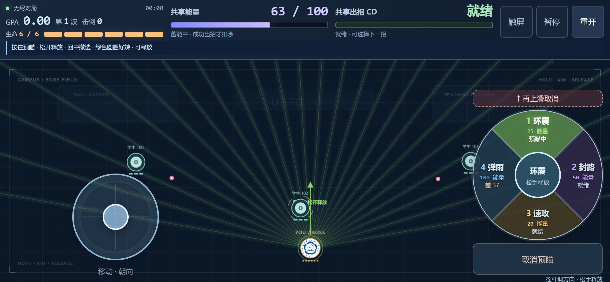

# 手机触控与选招转盘

2026-10-08 用户要求手机自动切换为左侧虚拟摇杆操作，随后将右侧四个技能按钮改为一个滑动选招转盘。手机和键鼠共用同一游戏与单文件 HTML，核心仍为配置 v6 / Web ABI v5。手机操作改变输入映射和界面，费用25/50/20/100、无尽派学生、GPA、伤害、速度上限与C攻击计划继续由原核心裁决。

## 操作

左手在左下触区按下，当前位置成为摇杆输入原点。轻推慢走、推远全速；松杆立即停步并保留最后有效朝向。右手按住右侧转盘中央，滑向一招预瞄，再松手释放。左杆同时负责移动和技能方向，右指只选择招式，移动角色或滑动转盘不会把瞄准方向带偏。

| 转盘方向 | 技能 | 能量 |
| --- | --- | --- |
| 上 | 1 环震：前向宽弧双波 | 25 |
| 右 | 2 封路：分列弹墙 | 50 |
| 下 | 3 速攻：窄扇三连 | 20 |
| 左 | 4 弹雨：扫描雨 | 100 |

中心未选时松手不发招。滑回中心撤选，可在同一次按住中再次滑向技能；上滑至盘上方的取消区或按取消按钮永久撤销当前手势，随后松手也不会发招。取消只清技能，左杆走位继续。不同扇区切换立即更新C预瞄，不发上一招；最终只释放当前选择一次。能量不足或共享CD中仍可看预瞄，松手由C拒绝，不扣费、不排队。

转盘中央按钮直径64个CSS像素；滑至距中心20像素外开始选择，回到18像素内撤选，中间保留原状态。每个方向名义上占90°；已选扇区在中心方向的±53°内保持，跨过边界8°后才换招，减少拇指在斜线附近抖动造成的误切。接入键盘时，Space立即取消旧转盘，数字键接管预瞄后旧转盘不能抢回或释放新选择。

顶部保留生命、GPA、能量、共享CD、暂停和重开。手机顶部不重复四个小技能键；菜单和顶部都可手动切换“触屏/键鼠”，每次页面加载默认重新自动识别。换控制模式只取消未提交输入，不重开当前游戏或改变C已接受弹道。

手机建议直接打开[在线试玩](https://cheng-xiu.github.io/ustc-danmaku/)。转盘、摇杆与四招介绍同时打包在[单文件游戏](../demo/ustc-danmaku.html)内。

## 识别依据

`apps/web/src/input/controlMode.ts` 根据浏览器公开信号选择默认模式，没有按屏幕宽度直接判手机：

- 要有 `navigator.maxTouchPoints > 0`。
- UA-CH明确mobile，或iPhone/iPod/Android Mobile等手机UA，选择触屏。
- iPad UA、MacIntel平台且多点触控覆盖iPadOS桌面UA；Android平板结合主指针coarse选择触屏。
- 其余主指针coarse且无hover的触控设备也选择触屏；主指针fine的触屏笔记本仍可用键鼠。
- 不满足触屏条件的窄桌面窗口保持键鼠。浏览器信号不能保证每一种设备识别正确，手动切换处理特殊浏览器与外接鼠标场景。

检测只使用本页浏览器已有的输入能力与UA信息，不请求设备权限，不上传这些信号。QA模式只读显示检测结果，不提供修改World的入口。

## 输入与手感细节

摇杆有效半径为 `max(28, min(52, zoneWidth*0.25, zoneHeight*0.3))` 个CSS像素。以 `s=min(距离/半径,1)` 计算幅度：`s<=0.12` 输出零；否则输出 `((s-0.12)/0.88)^1.45`。这让中心附近更容易细调方向和慢走，推至外圈达到原C配置的速度上限；斜向不会加速。视觉圆心为完整显示可单独钳位，但输入原点始终是实际下指点，所以触区边缘按下也不会立即走位。

摇杆轴和技能指针分别拥有捕获。手机模式忽略屏幕指针的鼠标位置投影，右手切招不会改变移动或朝向。松杆回中保留方向；按住预瞄时只有有效摇杆方向变化更新朝向，Boss位置变化不参与重算。释放将单位方向复制进现有输入包，之后转向不会修改该次请求。

暂停、重开、失焦、页面隐藏、旋转和手机窗口resize清除触控捕获、移动轴、预瞄及尚未消费的释放请求。桌面模式的普通resize仍保持原键鼠预瞄契约。局内改变窗口比例只等比显示当前场地，重开后再按新比例铺满。安全区通过 `viewport-fit=cover` 与 `safe-area-inset-*` 留边，开始菜单可以触摸滚动。

手机系统按钮直接处理捕获的触点释放，并去重兼容click；双指摇杆与转盘按住时，第三指也能暂停、重开或切换模式，不依赖只有主触点才生成的鼠标click。

## 验证与复跑

从仓库根执行：

```powershell
npm.cmd test
# 已有最终构建时可单独执行：
npm.cmd run test:mobile:input
npm.cmd run test:mobile:browser
```

设备识别的18个公开信号探针与手机输入35场景/585断言覆盖误识别、方向缓存、模拟幅度、单次释放、旧owner与取消；原键鼠输入54场景/431断言保持。浏览器脚本使用最终离线HTML、Chrome的设备模拟、原生CDP多点触摸及真实键鼠事件，检查转盘四扇区、中心中性/回中、取消、双指方向、系统多指操作、横竖屏和只读C预瞄/接受后弹道。实际结果、版本与文件哈希以本轮原始证据为准。

2026-10-08 从根执行完整 `npm.cmd test`，退出码0。原始记录放在独立的 [mobile-wheel 验证目录](validation/mobile-wheel/)，旧报告保持原样。

| 验证 | 本轮实际结果 | 原始证据 |
| --- | --- | --- |
| 构建、原生与完整串行入口 | 原生13/13，其余步骤全部通过 | [root-test.log](validation/mobile-wheel/root-test.log) |
| 手机识别公开信号 | 18/18 | [control-mode-probe.json](validation/mobile-wheel/control-mode-probe.json) |
| 手机输入探针 | 35场景、585断言通过 | [mobile-input-probe-results.json](validation/mobile-wheel/mobile-input-probe-results.json) |
| 键鼠输入探针 | 54场景、431断言通过 | [aim-input-probe-results.json](validation/mobile-wheel/aim-input-probe-results.json) |
| 最终离线转盘、多指与检测 | 8种设备模拟、326/326，0脚本错误/外部请求/失败请求 | [mobile-browser-smoke.json](validation/mobile-wheel/mobile-browser-smoke.json) |
| 已发布HTTPS分批检查 | 8种设备、340项设备检查通过，每档HTTP200与响应哈希一致 | [pages-coverage.json](validation/mobile-wheel/pages-coverage.json) |
| 增加线上单档入口后的默认离线回归 | 8档326/326，0错误/额外请求/失败请求 | [final-default-mobile-browser.json](validation/mobile-wheel/final-default-mobile-browser.json)、[日志](validation/mobile-wheel/final-default-mobile-browser.log) |
| 同文件键鼠浏览器回归 | 282/282、15次实际发招 | [v6-aim-browser-smoke.json](validation/mobile-wheel/v6-aim-browser-smoke.json) |
| 同文件无尽回放 | 18/18，真实清波、预告和下一波出生 | [v6-browser-endless.json](validation/mobile-wheel/v6-browser-endless.json) |
| Native/Wasm对照 | 10场景、36,010快照，最大浮点差3.814697×10⁻⁶ | [core-parity.json](validation/mobile-wheel/core-parity.json) |

设备包括iPhone竖屏390×844、横屏844×390、小屏320×568、Android412×915、iPad桌面UA、常规/窄桌面与Windows主指针coarse触屏模拟。三种主要手机档执行完整双指/三指场景，其余检查自动识别和界面。测试原生触摸移动以被动DOM事件观察等待浏览器投递，不推进RAF或C tick；取消与键盘接管回归在同一逻辑帧内操作，拒绝旧转盘重新提交。

交付HTML为 **1,198,748字节**，SHA-256为 `c931f75e78a1dce721df74c52f8abab2ef0d14f766b619db0b473e7c17da0f00`；三份最终浏览器报告都对应这个文件。[完整性记录](validation/mobile-wheel/integrity.json) 确认构建与提交交付文件一致、165个既有核心/参考/历史文件无修改。Wasm仍为62,152字节、SHA-256 `9dbd096c2eac3792de2c22b5af54725591fd99502f6239b16a41257a13c21b93`，原PDF哈希也保持原值。源码提交身份通过线上 `deployment.json` 记录，不往HTML反写提交号。

可用同一脚本验收发布后的HTTPS页面，每个设备检查HTTP200与完整响应体哈希，并把结果单独写入 `build/mobile/mobile-pages-smoke.json`，不覆盖离线报告：

```powershell
node tests/web/mobile-browser-smoke.mjs demo/ustc-danmaku.html https://cheng-xiu.github.io/ustc-danmaku/
# 出现导航问题时，可单独补验指定设备；结果另存，不覆盖整批记录：
node tests/web/mobile-browser-smoke.mjs demo/ustc-danmaku.html https://cheng-xiu.github.io/ustc-danmaku/ "Windows primary coarse touch"
```

本轮HTTPS整批运行先在第4档加载超过30秒，重试后前7档全部完成，第8档遇到 `ERR_CONNECTION_RESET`；随后第8档独立检查19/19通过。上述340项是分批覆盖的设备检查，不能写成一次整批无网络失败。原始 [首次导航超时](validation/mobile-wheel/pages-load-timeout.json)、[前7档与连接重置](validation/mobile-wheel/pages-seven-profiles.json)、[第8档补验](validation/mobile-wheel/pages-windows-profile.json) 均保留，已完成各档没有脚本错误或额外资源请求。[发布身份核验](validation/mobile-wheel/pages-integrity.json) 对应游戏提交 `c14352e60b17ada532914610acd2d0777e2a5e88`；后续只增加验证说明和补验脚本入口，游戏HTML字节不变。

以下截图来自本轮最终文件的Chromium模拟。横屏展示按住转盘预瞄，竖屏用于检查触区和顶栏布局。



[查看手机竖屏截图](assets/mobile-wheel-portrait.png)。

检测模拟和自动化输入可以验证逻辑、布局与手势隔离，不能等同于实体iOS Safari/Android浏览器性能或真人拇指手感。当前没有实体手机实测记录；下一步真人试玩重点观察扇区边界是否误选、取消距离是否舒适、中心细调与连续闪避是否顺手，记录设备、浏览器和方向。
