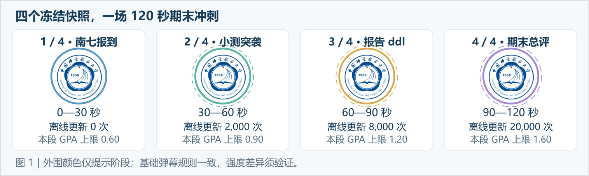
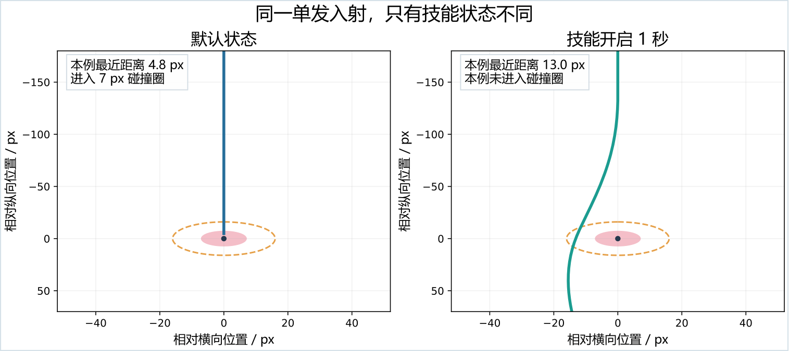
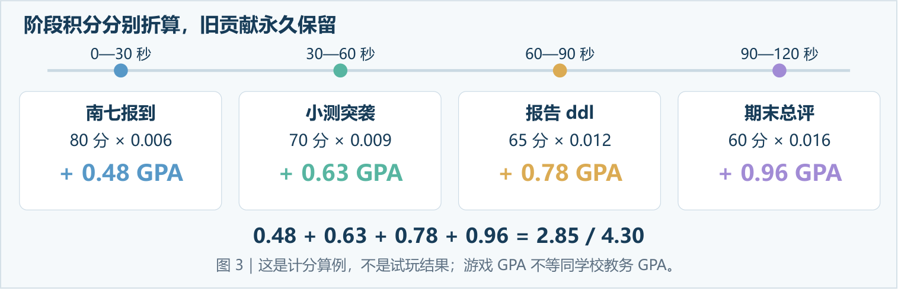
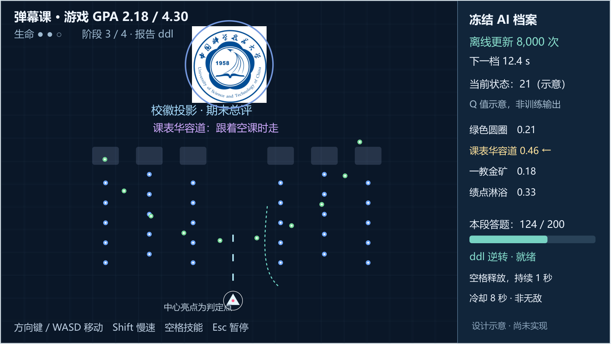
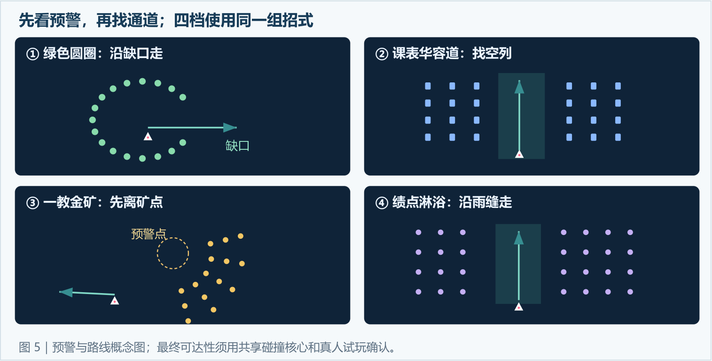
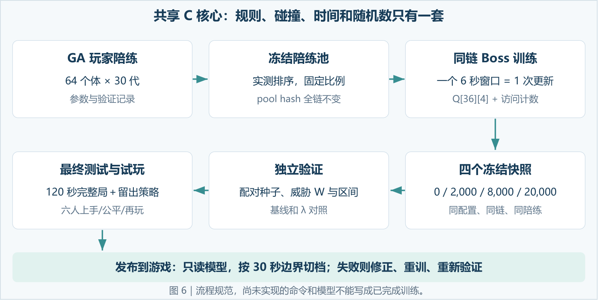

# 《科大弹幕录：绩点保卫战》

**最终项目规划与交付规范 · v3.1 · 2026-10-05**

> 本文由完整 v3.1 PDF（23 页）转写为 Markdown，保留正文、表格、公式、命令、链接和源文档示意图；仅去除排版页眉页脚并修复跨页断行。核对原件：[完整 PDF](../references/project-spec-v3.1.pdf)。

一场南七学生的期末冲刺：校徽当考官，课表、食堂和群聊梗成为弹幕；四个训练快照按固定时间接力，最后交出一张游戏 GPA 成绩单。

| 项目 | 规划要点 |
| --- | --- |
| 项目基础 | 计算机程序设计 C* 自拟题目；三人协作；Windows / EasyX / C99 或 C11 |
| 正式玩法 | 单场景、单 Boss、四种弹幕招式；3 格生命；120 秒生存挑战 |
| 难度 | 每 30 秒切换一档；对手使用 0 / 2,000 / 8,000 / 20,000 次离线训练快照 |
| 成绩 | 各阶段积分按权重折算为 0.00—4.30 的游戏 GPA |
| 文档内容 | 项目规划、玩家手册、可玩性评估、AI 训练手册、实施与验收规范 |
| 实施状态 | 规划定稿；游戏、训练模型和真人试玩仍待实施验证 |

本文件定义游戏规则、校园表达、玩家操作、评分方式、AI 训练流程和交付验收要求。四档模型、完整游戏、满分可达性与真人可玩性仍须团队实施和验证；游戏 GPA 是本游戏的计分规则，不等同教务系统 GPA。



图 1｜外围颜色仅提示阶段；基础弹幕规则一致，强度差异须验证。

### 阅读导航

1. [一、项目概览与实施范围](#chapter-1)
2. [二、校园背景、Boss 与梗的落地](#chapter-2)
3. [三、战斗规则与四招式](#chapter-3)
4. [四、固定难度与 GPA 折算](#chapter-4)
5. [五、玩家手册](#chapter-5)
6. [六、可玩性预评估与试玩方案](#chapter-6)
7. [七、界面与视觉示意](#chapter-7)
8. [八、三人分工、接口与工期](#chapter-8)
9. [九、AI 训练手册](#chapter-9)
10. [十、验收、交付与风险](#chapter-10)

<a id="chapter-1"></a>

## 一、项目概览与实施范围

### 1.1 玩法概要

玩家在 120 秒期末冲刺中躲避四类校园生活弹幕，并以自动射击获得阶段积分。四个 AI 快照按固定时间接力；移动、慢速和技能构成战斗操作。每段积分独立封存并折算为游戏 GPA，另可进入任一阶段进行单阶段练习。

### 1.2 制作原则

优先保证能看清、能躲开、按技能有反馈，再追求梗和 AI 的展示效果。战斗只有移动、慢速、技能三类操作，射击自动；方向键或 WASD 二选一，另用 Shift 慢速、空格发动技能、Esc 暂停。

无图形仿真、固定步长和日志是单独的工程要求，操作简单并不自动保证训练快或结果可靠。校园特色同时落在视觉、叙事、阶段命名和计分方式中；允许使用真实校徽，并配合学生生活内容形成辨识度。

### 1.3 首版范围

必须完成：四招、校徽 Boss、固定四阶段、GPA、技能与擦弹、成绩单、单阶段练习、GA 陪练、冻结 Q 表、训练日志和真人试玩。先做这些内容的一条完整闭环。

首版聚焦完整挑战与单阶段练习，不包含排行榜、玩家种子挑战入口、随机升级、多角色、联网、多人或在线训练。训练器使用可复现种子，以支持公平评估。

### 1.4 功能需求与非功能需求

以下是实现与验收的对应表，功能名称、手册和训练器共用同一规则，防止各章节分别描述出不同游戏。

| 编号 | 需求 | 实现位置 | 验收证据 |
| --- | --- | --- | --- |
| F01 | 三血、移动/慢速、自动射击、一次按下触发技能 | 共享 world/input/field | 输入事件、碰撞和技能日志 |
| F02 | 四档各 30 秒，按逻辑时钟换冻结 AI | stage＋model | 三种玩家轨迹的加载 tick 与文件 hash |
| F03 | 四种生活梗弹幕，预警、通道、实体判定一致 | patterns＋collision | 底边/四角压力检查与真人受击复盘 |
| F04 | 阶段封顶积分折算为 4.3 制游戏 GPA | score | 上界、边界、死亡 tick、重复事件检查 |
| F05 | 任选四档练习，30 秒，成绩独立 | menu＋stage＋score | 四个入口、模式标识、重试与重置 |
| F06 | 可独立阅读的玩家手册和成绩说明 | ui＋docs | 新手上手和复述计分规则记录 |
| F07 | 离线 GA＋Boss 训练、快照、验证及复现 | ai＋sim | 种子、Q/N、训练链与对照结果 |
| N01 | 游戏、训练器共用纯 C 逻辑，渲染不影响随机数 | core 与 render 分离 | 同构建同种子动作/事件一致 |
| N02 | 目标 60 fps，逻辑 60 Hz，掉帧不改变阶段规则 | 主循环与定步长 | 实际机器型号、帧耗时与逻辑追赶记录 |
| N03 | 发布包离线可运行，不依赖账号或模型下载 | release | 在未装训练工具的另一台 Windows 机器试运行 |
| N04 | 模型错误有清楚提示，不静默伪装成训练成果 | model_io＋ui | 缺文件、hash 不匹配、非法数值的错误路径 |
| N05 | 颜色之外还靠形状、运动和文字识别威胁 | render＋patterns | 低亮度/无声音下仍能识别预警与判定点 |

首版不指定未经测量的显卡、内存或磁盘“最低配置”，也不承诺某一 GPU 训练时间。交付时记录真正测过的机器和构建版本。

<a id="chapter-2"></a>

## 二、校园背景、Boss 与梗的落地

### 2.1 一句话定位与背景故事

你是一名赶期末 ddl 的蜗壳学生，在校徽投影的四轮弹幕考核里躲开课表、食堂和实验报告，靠走位、自动答题和“ddl 逆转”争取一份 4.30 的游戏成绩单。

期末前夜，“南七学期模拟器”误把课程表、实验报告和群聊整活编译成了试卷。你刚从桃李苑出来，下一节课与报告截止同时逼近。屏幕中央的校徽忽然亮起：“欢迎参加弹幕课。少废话，你游戏 GPA 多少？”

系统依次加载四个训练快照：报到、小测、报告周、期末。你需要撑过 120 秒，持续提交自动射击的“答题弹”，在危险时按空格把身边弹道拧开。失败不是真实学业评价，结算只谈这一局：“已交卷”“补交申请中”“ddl 前再来一局”。以上事件、系统、台词均为游戏创作。

### 2.2 Boss：校徽投影·期末总评

Boss 中心使用官方科大校徽图形，外围绘制阶段环、预警标记和答题进度。封面图 1 使用四种外围配色表达阶段，中心校徽保持原样；颜色不改变弹量、技能或判定。保留校徽原本的比例、配色与辨识度；攻击特效在外围展开。采用校方说明页提供的校徽图作为示意依据。[官方校徽说明与素材](https://djyszw.ustc.edu.cn/info/1070/6835.htm)

Boss 固定在战场上方，以本阶段答题进度显示有效命中；达到目标后亮起完成标记，但不会提前结束阶段。正式模式仍按时切换，完整一局依次面对四个 AI。自动射击因此兼具答题反馈与计分价值。

### 2.3 梗怎样用，哪些属于事实

以下为游戏原创改编。网上来源用于确认名称、生活场景或梗的流传，不证明传播故事中的具体人物与事件。

| 素材 | 游戏落点 | 使用约定 |
| --- | --- | --- |
| “苕皮笑话”中的绿色圆圈 | 招式“桃李苑·绿色圆圈好辣” | 使用物件和语感；不采用未经核实的真人故事或身份标签。网络梗合集为二次汇编。[公开合集](https://github.com/RWUSTC/USTC_tales_of_SCGY) |
| 桃李苑、食堂与赶饭 | 开局字幕、绿色环形弹幕 | 桃李苑为真实食堂名称；剧情“吃完立刻考试”为创作。[招生办美食介绍](https://zsb.ustc.edu.cn/_t4927/sjms/list.psp) |
| 蜗壳、南七技校、GPA 质问、一教金矿 | 玩家称呼、Boss 台词、招式与结算 | 学生论坛讨论过这些梗；金矿按虚构整活处理。[南七茶馆讨论](https://ustcforum.com/d/1801) |
| 课表华容道、跨区赶课 | 课表封锁带、路网背景 | 有学生排课工具使用这一标题；真实课程数据不写入游戏。[学生排课工具](https://paike.feixu.site/) |
| 科大月饼、玉泉北路樱花 | 背景图标、加载小字、成绩单印章 | 校园文化彩蛋，不新增补血道具或独立第五招。[月饼活动](https://www.ustc.edu.cn/info/1366/23401.htm)、[玉泉北路通知](https://www.ustc.edu.cn/info/1364/24781.htm) |

梗密集主要放在招式标题、章节字幕和结算评语中。战斗提示始终写清行动，例如“绿色环有缺口”“沿竖向空隙移动”；不要求玩家先懂梗才能活下来。

### 2.4 四阶段文案

| 阶段 | 标题 | 开场字幕 | 失败/完成反馈示例 |
| --- | --- | --- | --- |
| 1 | 南七报到 | “课表还没排明白，弹幕先来了。” | “至少教室找对了。” |
| 2 | 小测突袭 | “这题上课讲过。哪节课？下一节。” | “先交卷，再讨论过程分。” |
| 3 | 报告 ddl | “报告写到第几页了？弹幕写到第三轮了。” | “已生成补交申请。” |
| 4 | 期末总评 | “少废话，你游戏 GPA 多少？” | “4.3，但是弹幕课。”／“ddl 前再来一局。” |

<a id="chapter-3"></a>

## 三、战斗规则与四招式

### 3.1 固定基础参数

| 项目 | 首轮实现配置 |
| --- | --- |
| 画面 / 逻辑区 | 1280×720；战场 x=0…959、y=0…719；右侧 320 px 为 HUD |
| 玩家合法区域 | 中心 x=20…940、y=220…690；初始 (480,600) |
| Boss | 中心 (480,100)，命中半径 56 px；不与玩家直接碰撞 |
| 时间 | 60 Hz 逻辑固定步长；渲染目标 60 fps；掉帧不改变阶段逻辑时间 |
| 玩家 | 普通速度 270 px/s，Shift 为 121.5 px/s；斜向归一化；判定半径 3 px |
| 生命 | 3 格；受击无敌 1.5 秒；同一 tick 最多扣一格 |
| 自动射击 | 5 发/s，向上 700 px/s，每发命中计 2 答题单位；每阶段目标 200 单位 |
| 敌弹 | 默认半径 4 px；弹池上限 800；模板参数固定并记录配置版本 |
| 招式窗口 | 每 6 秒一招：1 秒预警＋5 秒攻击；窗口末清敌弹，玩家弹保留 |
| 技能 | 半径 170 px，持续 1 秒，冷却 8 秒，从释放时开始；每按下一次触发一次 |
| 正式结束 | 存活至 120 秒通关；生命先耗尽则失败；暂停停止所有逻辑计时 |

以上为待实现起点，尤其答题 200 单位、预警 1 秒和弹速必须试玩校准。基础参数修改后需重新训练、验证并冻结，不能在局内按表现更改。

### 3.2 “ddl 逆转”与“压线提交”

空格触发“ddl 逆转”：短暂改变附近敌弹运动，在包围中创造转移机会。场力由统一的有符号系数控制，技能改变附近敌弹轨迹；它不提供无敌效果。

$$
\mathbf{a}=(1-d/R)\times\left[K_r(\mathrm{state})\cdot\hat{\mathbf{r}}+K_t(\mathrm{state})\cdot\hat{\mathbf{t}}\right],\qquad 0<d<R
$$

仅 $0<d<R$ 时生效。

$\hat{\mathbf{r}}$ 从玩家指向子弹，$\hat{\mathbf{t}}=(-\hat{r}_y,\hat{r}_x)$；按屏幕 y 向下坐标直接实现。默认 $(K_r,K_t)=(+100,0)$ 是径向向外；技能 $(-450,-300)$ 是径向向内加切向偏折。表中已含符号，公式不再额外乘 s。技能的作用来自组合轨迹变化，不能画成保证无敌的护盾。坐标方向与曲线示意以实际积分为准，不用“顺/逆时针”替代向量定义。

原 `isolate.py` 的四组静止、单发、120 Hz 检查已重跑，技能配置的最近距离为 19.4 / 14.1 / 10.7 / 8.2 px。它只支持该测试条件下的偏折，不能证明新版移动玩家、多弹、60 Hz、有限技能时长和实体弹半径下的安全性。正式版须做共享核心复测。

技能释放后的前 0.25 秒，第一枚符合擦弹规则的敌弹触发“压线提交”。每次技能最多一次，奖励有限积分与反馈，不退款、不续时、不缩短冷却。普通擦弹与压线提交可以同时记各自一次，但两项均有阶段封顶。



图 2：有限数学说明，非成品验证。玩家静止、敌弹初始相对位置 (0,-400)、速度 240 px/s、60 Hz 半隐式 Euler、敌弹半径 4 px、相对线段扫掠；技能只在 t=1.10—2.10 秒开启。红圈是 7 px 碰撞阈值，虚线是 16 px 擦弹阈值。单发偏折不证明所有方向、多弹或移动状态安全。

### 3.3 判定与计分顺序

敌弹碰撞阈值是玩家半径与弹半径之和，默认 7 px。擦弹范围为中心距离不大于 12 + 敌弹半径，且未碰撞；默认是 (7,16] px。碰撞和擦弹都取该 tick 双方相对运动线段的最小距离，不能擦弹只查端点。同一敌弹整局只计一次擦弹，使用唯一 ID 加弹池世代号，不能使用可复用数组下标代替。

每 tick：读取输入与技能→选择/生成预警及弹幕→移动并积分→用双方相对运动线段检查扫掠碰撞→结算一次受击与无敌→对未命中、非无敌的敌弹检查一次擦弹/压线→记自动射击命中→累计存活和分数→处理窗口/阶段边界。优先级与初始时刻必须在共享核心统一。

致命受击是一个明确分支：该 tick 仍归属原阶段，T 计到该 tick 末；扣至零生命后立即冻结成绩，不再计该 tick 后续的 D/g/p，不再启动新窗口或切入下一档。终局边界若该 tick 致命，失败优先于通关。非致命受击后可以计正常答题命中，但这一帧不计技巧分。

受击那一帧及 1.5 秒无敌期间不奖励擦弹或压线。分数不因受击直接倒扣，死亡使后续积分停止。相撞敌弹移除，生成于玩家判定圈内的弹幕判为模板错误。点采样不得漏掉高速弹；新规则必须使用扫掠碰撞或经验证的等价方法。

### 3.4 四招式：学生生活进入弹幕形状

四档均可选择全部四招，档位改变的是 AI 选招能力；不按阶段解锁新弹幕或增加弹速。每招有明确预警和退出路线。

| 动作 ID / 招式 | 弹幕玩法 | 初始参数与逃生约束 | 梗与提示 |
| --- | --- | --- | --- |
| 0 桃李苑·绿色圆圈好辣 | Boss 放出三圈带缺口的绿色弹环；每圈缺口方向缓慢变化 | 180 px/s；每圈 18 发，连续移除 4 个扇区弹；生成于 Boss 周边。三圈分时释放，缺口不得突变封死 | 青椒圈只是轮廓；提示“沿缺口出去，别站在辣圈边上” |
| 1 选课系统·课表华容道 | 预警三列课程格，顶部下落封锁弹带，通道向相邻列移动 | 220 px/s；三次下落波，至少保留一个 110 px 宽的连续通道；新旧通道有重叠或可达连接 | 暗色课表在背景，敌弹独立高亮；提示“跟着空课时走” |
| 2 一教金矿·绩点淘金 | 金色矿点预警后喷出扇形弹，两侧留逃脱方向 | 200 px/s；三个扇面、每面最多 12 发；矿点与玩家距离≥180 px，不得在玩家身边生成 | 原梗本就虚构；提示“先离开矿点，再看扇面间隙” |
| 3 期末总评·绩点淋浴 | 上方弹雨依次向左或右扫描，逼玩家换向与上下调整 | 240 px/s；五次短波，每波最多 16 发；保留≥100 px 竖向缝隙，扫描速率限定 | 提示“沿雨缝移动，别把自己挤进角落” |

三圈/三扇/三波分别在攻击期开始后的 0、0.7、1.4 秒生成；淋浴五波在 0、0.4、0.8、1.2、1.6 秒生成。所有顶部弹从 y=100 附近进入场地，具体偏移记录在模板配置。最低 180 px/s 从 Boss 到底部 y=690 需约 3.28 秒；六秒窗口中有五秒攻击时间，早期波具备抵达下区的时间，实际轨迹仍须计入场力与角度验证。原三秒方案因提前清弹而可能出现底部站桩漏洞，已取消。

模板验收加入底边中心、合法四角、中线静止和仅横移等退化策略，检查每招的代表轨迹能抵达合法下区；不能让同一个不动点在全部四招下稳定存活。某一招的缺口允许局部安全，但其位置与移动不能使全部 AI 都无法威胁简单站桩策略。若不通过，统一调整生成时刻、位置或窗口，重建配置并重训；不能只为高档增加弹量。

这些发数、速度、缝隙是配置起点，几何通道不自动等于玩家能及时到达。C 用脚本检查出生距离、预警时长、连续可达路径；A/B 用同一碰撞逻辑检查代表局面。复杂青椒纹理、矿石、课表均放在视觉层，不改变判定。

<a id="chapter-4"></a>

## 四、固定难度与 GPA 折算

### 4.1 每 30 秒换一个训练快照

| 正式逻辑时间 | 阶段 | 离线累计更新 | GPA 上限 | 每阶段积分折算 |
| --- | --- | --- | --- | --- |
| [0,30) s | 南七报到 | 0 | 0.60 | 每 1 分→0.006 GPA |
| [30,60) s | 小测突袭 | 2,000 | 0.90 | 每 1 分→0.009 GPA |
| [60,90) s | 报告 ddl | 8,000 | 1.20 | 每 1 分→0.012 GPA |
| [90,120] s | 期末总评 | 20,000 | 1.60 | 每 1 分→0.016 GPA |

一次“更新”是一个六秒招式试验结束后的 Q 表反馈更新，不是帧数、整局数或 GA 世代。四表来自同一链，早期表就是后期表的训练前缀。0 次表采用均匀随机的并列最大值选择，是清楚可复现的基线。

按 30/60/90 秒边界换表，清除旧敌弹和在飞玩家弹，冻结旧阶段积分；生命、技能冷却保留。下一窗口的 1 秒预警兼作章节提示，计入新阶段，不额外插入停表时间。每阶段恰好五个六秒窗口。

模型会读取当前位置、移动趋势和技能是否就绪来选招，这是推理；阶段时长、表编号、弹速、弹量、技能和评分系数由固定配置决定。全程不更新 Q、不训练玩家行为、不按受击或 GPA 调整难度。

训练次数增加不能保证威胁单调增加。0/2,000/8,000/20,000 为首轮检查点计划；发布前必须验证四档差异。若需要调整更新数，重训同一链、替换全套清单、同步表格与界面，不能任意拼接模型或拿更密弹幕充当 AI 进步。

### 4.2 阶段积分与总 GPA

对第 i 阶段，记录存活秒数 $T_i$、自动射击答题单位 $D_i$、有效擦弹数 $g_i$、压线提交数 $p_i$：

$$
S_i=60\cdot\frac{T_i}{30}+20\cdot\min\left(\frac{D_i}{200},1\right)+15\cdot\min\left(\frac{g_i}{30},1\right)+5\cdot\min\left(\frac{p_i}{3},1\right)
$$

$$
\mathrm{GPA}=\sum_i\left[w_i\cdot\frac{S_i}{100}\right],\qquad w=(0.60,0.90,1.20,1.60)
$$

每阶段 0—100 积分，原始总分最多 400，GPA 最多 4.30。未进入阶段各项为零，失败所在阶段按实际存活与已发生事件计分。四段权重不同，不能将原始总分直接乘 4.3/400。存活占 60%、自动射击命中占 20%、封顶技巧占 20%；不鼓励无限擦同一颗弹或靠长局刷分。

每项只增不减，阶段切换后永久冻结旧分；新倍率只用于新阶段。内部保留足够浮点精度，显示两位小数，最终结算再四舍五入。不在每帧舍入后累计。技能冷却从释放开始且跨阶段不重置；练习开局技能就绪，与正式局的中途状态不同。

| 例子 | 阶段积分 | 游戏 GPA |
| --- | --- | --- |
| 第一阶段满分后死亡，尚未进入第二阶段 | 100 / 0 / 0 / 0 | 0.60 |
| 完成四阶段，积分逐段不同 | 80 / 70 / 65 / 60 | 0.48+0.63+0.78+0.96 = 2.85 |
| 四阶段满分 | 100 / 100 / 100 / 100 | 4.30 |
| 仅玩第三阶段练习，得 80 分 | 只统计本次练习 | 0.96 / 1.20（阶段贡献），不能显示为完整局 GPA |

此“GPA”是游戏自定义成绩。学校真实 GPA 使用课程学分加权，不能把本公式称作教务处正式换算表；用户指定的 4.3 满分在本游戏中落实。[教务处成绩记载说明](https://www.teach.ustc.edu.cn/service/svc-student/13801.html)



图 3｜这是计分算例，不是试玩结果；游戏 GPA 不等同学校教务 GPA。

### 4.3 成绩单与评语

正式结算显示：通关/未通关、游戏 GPA/4.30、四段积分及各自 GPA 贡献、存活时间、有效命中单位、有效擦弹、压线提交、技能使用、受击阶段。展开区显示实际模型版本和种子供开发核查；首版不提供玩家选种子挑战、榜单或跨局最高分功能。

评价先按通关状态，再给趣味文案：通关“本次已交卷”；未通关“补交申请中”；满绩“4.3，但是弹幕课”。低成绩不映射为真实学生的能力或日常权利。

<a id="chapter-5"></a>

## 五、玩家手册

### 5.1 30 秒内读懂玩法

你要在三格生命耗尽之前撑到 120 秒。自动射击替你提交答案；你负责移动、找弹幕空隙，必要时按空格使用“ddl 逆转”。每 30 秒换一档 AI，后期同样的阶段积分可折算更多游戏 GPA。

| 操作 | 作用 | 最实用的时机 |
| --- | --- | --- |
| 方向键或 WASD | 移动 | 大范围撤离、离开角落、追上空隙 |
| 按住 Shift | 慢速并强调中心判定点 | 窄缝中微调，不要全程慢速赶路 |
| 空格 | ddl 逆转，1 秒；8 秒冷却 | 几路弹幕即将合围时，边开技能边离开 |
| Esc | 暂停/继续 | 暂停后计时、弹幕、冷却、积分都停止 |
| 自动射击 | 对准上方 Boss 时有效答题 | 能安全站位时保持横向对准，勿为命中硬撞弹 |

只有角色中心的 3 px 亮点算玩家判定，敌弹也有大小。受击扣一格并闪烁 1.5 秒；这段无敌时间用来撤离，不奖励贴弹得分。技能的圈表示作用范围，不能保证所有敌弹都躲开。

### 5.2 第一局建议

1. 开局先认亮点与预警，留在下半场但别贴角落。
2. 圈弹找缺口，课表找空列，矿点先离开，弹雨沿缝走。
3. 大范围移动用正常速度，窄缝按 Shift；快被夹住时按空格并转移。
4. 阶段提示出现时看训练次数和倒计时，冷却与生命不会重置。
5. 结算看受击阶段和答题进度；下一局先争取多活一个阶段，再追求擦弹与满绩。

擦弹是敌弹从身旁经过而没有命中，每颗只算一次。压线提交是在技能最初 0.25 秒内完成一次合格擦弹，每次技能只算一次。两项都封顶；稳住存活和自动射击，比冒险刷擦弹更重要。

### 5.3 单阶段练习

主菜单：开始完整挑战 / 单阶段练习 / 操作说明。练习只选择四档之一，界面显示实际离线更新数；使用与正式模式相同的招式、判定和评分规则。练习固定 30 秒，初始三格生命、技能就绪，结束显示本段 0—100 积分和本段 GPA 贡献上限。

练习不自动升级，不接续正式局，不把四次练习拼成一张 4.30 成绩单。失败可一键重试所选档位；正式模式失败则从第一阶段重新开始。两种模式始终有明显标识。

### 5.4 常见问题

| 问题 | 解释 |
| --- | --- |
| 我打得好，系统会偷偷变难吗？ | 不会。换档只看逻辑时间；固定模型根据当前状态选招属于既定玩法。 |
| 技能开了为什么还会受伤？ | 技能改变附近轨迹，不授予无敌；贴脸、高速或不利方向仍可能命中。 |
| Boss 答题条满了怎么还不结束？ | 本段答题分已拿满；还要存活到时间结束，不能跳过后续 AI。 |
| 到下一段 GPA 会变低吗？ | 不会。之前各段贡献已冻结，新段继续加分。 |
| 这是我的真实 GPA 吗？ | 不是，这是弹幕课的趣味成绩，满分 4.30。 |
| 练习第三段为什么只有 1.20 上限？ | 1.20 是第三段对整局的最大贡献；完整局才有四段 4.30 上限。 |

### 5.5 技能说明卡与切档提示

| 项目 | ddl 逆转 / 压线提交 |
| --- | --- |
| 触发 | 空格从松开变为按下，技能就绪时释放一次 |
| 作用 | 170 px 范围内改变敌弹轨迹；偏折效果需配合撤离 |
| 持续 / 冷却 | 持续 1 秒；释放开始计 8 秒冷却；跨阶段保留 |
| 常用时机 | 几路弹幕将合围、已确认撤离方向时；开技能后继续移动 |
| 进阶反馈 | 前 0.25 秒内第一次合格擦弹触发压线；一技能一次，阶段最多三次得分 |
| 局限 | 不是无敌；贴脸、高速或不利方向仍可能受击 |

换档前五秒，HUD 提高倒计时提示亮度，并显示下一档名称和真实离线更新数。提示不遮盖战场、不停止时钟、不暂停玩家输入。时间到先清旧弹、冻结旧分，再进入新段一秒预警；三血与冷却都不补满。

技能没触发时，依次检查：是否暂停、冷却是否已满、空格是否一直按住。就绪后要松开再按下，长按不自动连发。输入被接受时必须有图标/音效反馈；被拒绝时显示冷却或暂停状态。

不懂梗也能玩：在操作说明里提供可选的简短释义，例如“绿色圆圈取自校园网络梗，此处是有缺口的环弹”“课表华容道对应移动空列”。不新增通用版模式，战斗仍靠直接行动提示。

<a id="chapter-6"></a>

## 六、可玩性预评估与试玩方案

### 6.1 现阶段判断

**值得制作可玩原型，尚不能判定“已经好玩”。** 120 秒适合课间和课程展示，自动射击减轻操作负担，慢速与救场技能提供可学的技巧；四个公开快照和阶段 GPA 让进步目标清楚。单阶段练习直接解决后半局练不到的问题，密集校园梗可以增加同学间的传播动力。

最大不确定性是后期 AI 是否真的更有威胁、六秒清弹是否打断节奏、技能偏折是否直观、满分目标能否达到。36 状态的选招模型容易早早趋同，也可能长期重复最有效的一招。更多更新提供可解释的训练轨迹，但不能自动提供更丰富的体验。

| 维度 | 设计判断 | 必须用什么确认 |
| --- | --- | --- |
| 上手 | 三类战斗操作、自动射击，门槛较低 | 新手不经口头讲解的首局 |
| 节奏 | 四段目标明确；短窗口预警与清弹可能割裂 | 记录停顿感、死亡时间及反馈 |
| 公平 | 可见预警、实体碰撞、固定配置利于解释 | 连续可达路径检查＋真人受击复盘 |
| 技巧 | 对准、微调、技能时机有分工 | 技能使用收益、命中率、再玩改进 |
| 再玩 | 练习指定阶段＋阶段成绩有短期目标 | 自愿再次挑战，首版无需榜单系统 |
| 校园趣味 | 梗进入弹幕和反馈，辨识度较好 | 科大学生与外校玩家是否理解行动提示 |

### 6.2 首轮真人试玩

招募六位同学，其中至少三位没有弹幕经验；每人两局正式挑战，并试一次选定阶段练习。第一局只读游戏内说明。开发者为两局设置同一内部测试种子，以减少随机差异，不增加玩家种子界面。用匿名编号记录经验、存活、阶段、积分、受击、技能事件与简短评价，不采集真实 GPA。

| 指标 | 首轮目标（待验证） |
| --- | --- |
| 上手 | 至少 4/6 能独立移动、慢速和主动用技能 |
| 初期可达 | 至少 2/3 新手首局存活 45 秒以上 |
| 技能理解 | 至少 4/6 能说明技能是偏折而非无敌，且知道何时再用 |
| 进步 | 至少 4/6 第二局在存活、通过阶段或游戏 GPA 中有一项改善；同时记录退步者 |
| 阶段公平 | 无多人在同一未预警组合下集中秒死；重点回放第三、四段 |
| 计分理解 | 至少 4/6 知道存活、命中、封顶技巧都影响游戏 GPA |
| 练习价值 | 至少 4/6 可自行选择并重试指定 AI，明确练习与正式成绩区别 |
| 再玩 | 至少 4/6 表示愿再试，并记录原因；补充是否自愿开启第三局 |
| 梗与可读性 | 学生觉得有笑点，非本校玩家也能按提示躲弹；梗不得遮挡弹幕 |

六人结果用于项目调校，不代表普遍留存率。机器人能验证威胁和规则，不能替代“好笑”或“愿意再玩”的真人反馈。

### 6.3 不达标怎么改

先修输入、碰撞、时间和提示，再改基础弹幕配置，最后才考虑扩充玩法。若早期过难，调整统一模板与预警并重训；不能恢复按玩家表现降难度。若后期重复单招明显，先检查状态特征、奖励和数据；确需统一招式重复约束时，必须训练与正式模式同时采用，重建配置版本，不可只在发布时临时限制。

自动射击 200 单位与每段三次压线的封顶门槛，要检查可达性。满绩应是高手可追求的目标，而非依赖随机技能初态或不可能完成的发射量。若几乎没人主动擦弹，可以保留反馈并下调技巧比重；若清弹破坏连续感，应先重新定义反馈归因与训练窗口再改规则。

### 6.4 试玩记录与结果报告模板

记录重点包括上手速度、各阶段难度感受、技能理解、重玩意愿和校园梗反馈。每位玩家记录首次看懂判定点、主动慢速和用技能的时间，再比较两局存活与分项 GPA；访谈询问阶段是否重复、哪次受击显得不公平、哪些梗好笑或难懂。

| 记录 | 必填字段 |
| --- | --- |
| 单局日志 | 匿名编号、经验组、局次、构建/config/model hash、内部种子、各段进入/结束 tick |
| 行为 | 首次慢速与技能 tick、技能是否被接受、受击/死亡 tick、D/g/p、各段积分与 GPA |
| 反馈 | 操作理解、技能理解、计分理解、乐趣/挫败 1—5 分、具体困惑与不公平点 |
| 再玩 | 是否表示愿再试、是否实际主动开启第三局、选择正式还是练习及原因 |
| 报告 | 分母、成功人数、失败人数、经验组分布、均值/中位数及逐人变化 |

未测试时结果栏填“待测”，不填模拟的 7.8/10、60 人满意度、留存率或玩家引语。若以后取得外部试玩数据，先补构建、匿名原始记录和计算方法，再将其转为实测结论。六人、两局的课程试玩无需承诺两周留存或“行业平均”。

<a id="chapter-7"></a>

## 七、界面与视觉示意

### 7.1 战斗 HUD

显示“游戏 GPA 2.18 / 4.30”“阶段 3/4·报告 ddl”“离线更新 8,000 次”“下一档 12.4s”、三格生命、技能冷却、本段答题进度。右侧 AI 面板展示真实当前状态编号、四招 Q 值和本次选招；不把 Q 值标为移动概率，不写“正在学习你”。

新示意图以真实校徽、校园标题和固定阶段 HUD 展示布局，属于设计图，未连接运行中的模型或真实游戏数据。



*图 4：正式 HUD 设计，示意数值不代表训练或试玩结果。*

### 7.2 视觉规则

深蓝背景配白芯高亮敌弹；绿色环、金色扇形和课表蓝块只是辅助辨识，还须靠轮廓、运动和预警区分。正常玩家判定点常亮，Shift 时增强描边；技能作用圈使用细线，不画遮住敌弹的实心罩。

校徽作为外部素材登记来源；其余界面、弹幕和路网背景使用程序绘制。图 2 是给定参数与单发路径下的数学示意，用来解释技能方向，不代表完整游戏的运行结果。

### 7.3 成绩单布局

顶部为“弹幕课成绩单”和最终 GPA；中间四行依次列阶段、真实更新次数、存活、答题、擦弹、压线、积分、GPA 贡献。底部放完成状态、趣味评语、计分说明和重开按钮。练习成绩单固定显示“单阶段练习”，不留空白四段行误导玩家。

### 7.4 四招读图与 HUD 阅读顺序



*图 5：概念示意，箭头表示行动方向；正式轨迹以共享核心为准。圈找缺口，课表找空列，金矿先离开预警点，淋浴沿雨缝走。*

HUD 阅读顺序是：先看弹幕与中心判定点，再看生命/技能，最后看阶段与 GPA。右侧 AI 数值用于演示模型，不要求玩家懂 Q 表才能开始；正式玩家的行动提示保持直接。

<a id="chapter-8"></a>

## 八、三人分工、接口与工期

### 8.1 文件和职责

| 模块 | 负责人 | 文件与交付 |
| --- | --- | --- |
| 共享核心 | A | core/world、field、collision、score、stage；固定步长、生命、边界、唯一弹 ID |
| AI 与训练 | B | ai/bot、ga、bandit、sim_main；种子、训练、模型加载、日志、验证报告 |
| 招式与视觉 | C | core/patterns、render/ui、assets；四招安全通道、校徽、字幕、玩家手册 |
| 集成 | A 统筹，B/C 交叉检查 | game_main、配置冻结、模型清单、模式切换 |
| 交付与试玩 | C 统筹，全员 | PDF、报告亮点、贡献说明、录屏、匿名试玩记录 |

核心不依赖 EasyX；游戏与 sim 链接同一逻辑代码。文件所有权只约束日常协作，必要接口变更先协调并同步编译，不把三人工作割裂成三套仿真。

### 8.2 第一阶段冻结的接口

至少包括 `world_reset(config,seed)`、`world_step(input)`、只读观测、`state_encode`、`pattern_start(action)`、`score_snapshot`、`model_load`、`model_select`。`model_select` 在正式运行只读 Q，训练更新放在独立函数。输入与日志均携带 mode、stage_id、tick、config/model hash。

边界约定：游戏时间用整数 tick，30 秒=1,800 tick、120 秒=7,200 tick；窗口=360 tick、预警=60 tick、技能=60 tick、冷却=480 tick、无敌=90 tick、压线=15 tick。暂停不消费 tick。达到终局 tick 后停止产生计分事件；同 tick 最后一格生命耗尽时按失败处理。

窗口末先结算该窗口事件再清敌弹，下一窗口不保留旧弹；阶段末冻结积分并清玩家弹，避免迟到命中回写旧段。日志中 tick 编号采用 `[0,7200)`，存活到边界的 T 精确为 120 秒。

### 8.3 相对工期与课程里程碑

| 时间 | 工作 | 可验收输出 |
| --- | --- | --- |
| 第 1 周 | 冻结接口、规则与最小四阶段骨架 | 随机选招能完整跑 120 秒，GPA 不跳变 |
| 第 2 周 | 碰撞、技能、四招、校徽与 HUD | 可交互原型＋三档脚本陪练＋共享 headless 核心 |
| 第 3 周 | GA、Q 表、日志、四快照、练习模式 | 同链四份模型及覆盖记录，不宣称已通过强度验证 |
| 第 4 周 | 独立验证、连续局测试、六人试玩 | 训练曲线、难度比较、试玩记录与修正清单 |
| 第 5 周 | 必要重训、冻结发布、课程材料 | 最终模型、配置、成品、PDF、视频 |

这是五周实施顺序的估算，团队应按课程安排和可用时间调整；课程的具体提交格式与截止时间以授课教师发布的通知为准。

中期至少展示：能玩的随机基线、技能偏折、固定升档计时、GPA 和 headless 基准。模型未训练时明确显示“基线演示”；结项才展示通过验证的四档模型。避免在菜单播放长开场，十秒内可进入战斗。

### 8.4 文件结构与交接清单

```text
project/
  core/         world, input, field, collision, score, stage [A]
                patterns                                  [C]
  ai/           bot, ga, bandit, model_io, sim_main         [B]
  render/       renderer [A], ui/scene/text [C]
  assets/       官方校徽、来源记录、程序化绘图配置           [C]
  configs/      game/ga/boss/score 配置                      [三人冻结]
  models/       player 参数、pool、四档 checkpoint、release  [B]
  runs/         bench/train/validation/test 与复现记录      [B]
  docs/         玩家手册、构建/训练指南、报告和提示词         [C]
  game_main.c   正式游戏和练习入口                          [A 集成]
```

这是拟定源码布局，不表示这些文件已实现。A 交共享核心和接口版本；B 交模型清单、复现步骤和评估分项；C 交四模板参数、校徽来源、说明文案和试玩记录。集成前核对三人的 config hash，改规则后模型失效要明确标识。



*图 6：游戏与训练共用核心。陪练先冻结，再训练一条 Boss 链；验证、最终测试和真人试玩通过后发布。推理运行不回写模型。*

<a id="chapter-9"></a>

## 九、AI 训练手册

> 本节是待实现的训练与验收规范。现有 `verification/*.py` 只用于机制原型的局部复核，尚未实现本节的 GA、Q 表训练、检查点或 CLI。以下参数是首轮实施起点；正式模型须经 C 仿真器训练和独立验证后发布，目前四档模型仍待训练。

### 9.1 训练的目的与运行边界

项目用遗传算法（GA）训练玩家陪练，用情境老虎机 `Q[36][4]` 学习 Boss 在当前情境中选哪种招式。两层分开训练：先冻结陪练池，再训练一条 Boss 链；不同时更新双方。训练不依赖人工给动作贴标签，但会使用人工设计的适应度/奖励，应称“离线自动训练”，不能把有奖励的遗传搜索和强化学习统称为无监督学习。

正式游戏按**累计逻辑时间**执行四档：`[0,30)`、`[30,60)`、`[60,90)`、`[90,120]` 秒；暂停不计时，掉帧不改变逻辑时间。只在 30、60、90 秒边界更换已冻结的 Q 表。预定累计反馈更新数是 **0 / 2 000 / 8 000 / 20 000**，均来自相同种子、相同配置、相同陪练池的一条训练链。训练检查点中的“迭代”统一指**一个 6 秒招式反馈窗口结束后的一次 Q 更新**，不指帧数、GA 世代或整局数。

所有档位使用同一套弹速、弹量、判定、技能、预警和逃生通道约束。档位差异来自冻结 AI 的选招结果；玩家当前位置与技能状态影响选哪招，但不得影响加载哪档模型、阶段长度、奖励权重或密度。运行时禁止更新 Q、探索率、陪练权重；玩家表现不会触发隐藏难度调整。界面显示“当前档位 / 离线累计更新数 / 下一档倒计时”，不显示虚构的实时学习样本数。

**更新更多不保证更强。** 四个文件存在不等于难度曲线合格。相邻档位需在独立验证中呈现预期威胁差异，再由真人试玩确认手感；未证明差异前只能称“训练检查点”，不能宣布“难度升级已验证”。

### 9.2 冻结仿真规则与配置

训练前由 A/B/C 三人签定 `config_hash`，至少包含：逻辑场地尺寸、允许移动区域、60 Hz 定步长、移动及慢速速度、3 px 判定半径、3 格生命、1.5 秒受击无敌、擦弹半径、场力参数、技能 1 秒持续/8 秒固定冷却、完美判定 0.25 秒、四种弹幕模板、6 秒招式窗口、1 秒预警和 5 秒攻击、窗末弹幕清理、子弹上限、评分参数。游戏渲染为 1280×720，其中逻辑战场为 960×720、HUD 为 320 px；合法移动区 x=20…940、y=220…690。Boss 在 (480,100)，初始玩家在 (480,600)。训练器与游戏须读取同一套核心参数，不能因显示尺寸相同就默认逻辑一致。训练和 EasyX 游戏链接同一 `core/*.c`，渲染层不得参与碰撞、计分或随机数生成。

场力采用直接的有符号系数，**删除额外符号** `s`：

$$
\mathbf{a}=(1-d/R)\cdot\left[K_r(\mathrm{state})\cdot\hat{\mathbf{r}}+K_t(\mathrm{state})\cdot\hat{\mathbf{t}}\right]
$$

仅 $0<d<R$ 时生效。

$\hat{\mathbf{r}}$ 从自机指向子弹，$\hat{\mathbf{t}}=(-\hat{r}_y,\hat{r}_x)$。保留待重新验证的默认 $(K_r,K_t)=(+100,0)$ 和技能 $(-450,-300)$：前者是径向向外，后者是径向向内加按 $\hat{\mathbf{t}}$ 定义的切向偏折。不能把这套有符号系数写成“默认吸引、技能排斥”。$d\approx0$ 分支避免除零；场力积分、碰撞检测顺序在训练和游戏中一致。窗末清理与每发唯一 ID 一并实现，以免残留弹幕污染下一招奖励。

擦弹每颗敌弹仅记一次；受击帧/无敌期间不记擦弹，完美每次释放最多奖励一次、没有冷却退款。碰撞须检查单步运动线段，不能仅查更新后的端点来宣称 3 px 判定可靠。

### 9.3 玩家陪练 GA：先训练，后冻结

#### 9.3.1 观测与控制

陪练只读取玩家可见的当前位置、存活状态、技能剩余时间、冷却、已生成的弹幕位置/速度及 Boss 位置；不得读取下一招、未来随机数或未来生成的子弹。每 6 个逻辑 tick（0.1 秒）决策一次，候选动作是八方向移动与停留，共 9 个；对角速度归一化。可自动触发现有技能，不增加玩家按键。第一版陪练先用正常移动速度；若加入慢速，必须同步更新动作空间、训练预算和模型版本。

每个候选动作算六个归一化到 `[0,1]` 的特征：预测碰撞风险、子弹接近强度、边界风险、变向代价、偏离中线程度、自动射击对准程度。短期风险用可见的最近 24 颗接近弹，在共享核心中前推 0.4 秒，不生成未来弹；候选预测不是完整未来世界。先测该实现的 CPU 成本，再决定是否保留 24 颗上限。每帧随机乱跳不算 GA；动作特征由开发者设计，权重才由 GA 搜索。

例：`score(a)=-w1*risk-w2*approach-w3*edge-w4*turn-w5*center+w6*aim`。染色体先用 8 个数：六个非负权重 `[0,10]`、技能风险阈值 `[0.2,0.9]`、技能危险距离 `[20,120] px`。固定决策频率以减少搜索维度。权重为 0 合法；动作同分由专用种子流打破平局。技能就绪且预测风险达到阈值、近弹达到距离阈值时释放；训练中不得修改冷却规则。

#### 9.3.2 训练协议

首轮用种群 64、共 30 次代际评估、每个体 4 个训练种子：精英保留 4 个、锦标赛 3 选 1、逐基因交叉，单基因 10% 概率变异，变异幅度为取值范围的 10%，结果裁剪。每代所有个体共用同一组训练种子以公平比较，种子组按固定计划轮换，避免只适配四个局面。保存初始、第 10 次和第 29 次评估的代表参数以及完整日志，不把它们先验叫作弱/中/强。

陪练训练每次跑 **30 秒**、5 个统一招式窗口，Boss 使用固定均匀或固定循环基线，不能同时学习。初始适应度为 `0.65·T/30 + 0.25·HP_end/3 + 0.10·min(D/200,1)`；早死后 `HP_end=0`，时间上限 30 秒。D 是自动射击有效命中的答题单位。适应度以生存为主，避免 GA 为擦弹分故意送命；GPA 不反哺训练奖励。正式 120 秒完成率另测。

用独立验证种子评估三个 GA 快照与脚本陪练，根据**实际完成率、存活时间、受击数**定义强弱。初始池弱/中/强占比 30%/50%/20%，每档可含脚本与经过排序的 GA 策略；至少保留一个容易被命中的简单脚本提供正样本。若某快照性能倒退，按实测归档或排除，不能按代数硬贴强档标签。池冻结后记录每个策略的 ID、参数和 SHA-256，Boss 链全过程不改池。

### 9.4 Boss 训练：36 种情境、4 种招式

#### 9.4.1 状态编码

在每个招式开始前读取：

| 维度 | 分箱 | 边界约定 |
| --- | --- | --- |
| 横向位置 `ix` | 左/中/右，3 档 | 合法移动区等宽三分，边界归入右侧箱 |
| 纵向位置 `iy` | 上/下，2 档 | **合法移动区**上下等分，不能把不可达上半屏当训练状态 |
| 横向趋势 `iv` | 左/停/右，3 档 | 最近 0.3 秒位移/0.3；阈值 `-15/+15 px/s`，中间含边界 |
| 技能就绪 `ir` | 否/是，2 档 | 冷却为 0 且技能未生效才为“是” |

索引：`state=(((ix*2+iy)*3+iv)*2+ir)`，范围 0..35。训练、游戏、日志和 checkpoint 共用这一函数。技能正在生效与技能冷却都属于“否”，这是 36 状态方案的简化局限；若验证表明混淆严重，先调整采样与招式公平性，再评估是否扩状态，不能悄悄加载不同维度文件。

动作 0..3 一一对应正式四招，每招固定 6 秒：1 秒预警、5 秒攻击、窗末清理。Q 只决定招式，不能决定弹速或安全通道；所有动作都合法且必须出招，没有“等待/不出招”动作。0 更新的初始表全为 0，按固定 RNG 在并列最大项中均匀选择，形成明确的随机 Boss 基线。

#### 9.4.2 更新与奖励

采用零折扣情境老虎机：

$$
Q[s][a]\leftarrow Q[s][a]+\alpha\cdot(r-Q[s][a]),\qquad\alpha=1/N[s][a],\qquad\gamma=0.
$$

计数先加一。

这表示估计当前招式的平均即时奖励，不学习长期战术。首次采样的 α 为 1，后续样本平均；若改固定 α，需要重新跑整链并在报告记录原因。

首轮奖励：`r=h − 0.10·b`。`h` 为本窗口是否发生至少一次**有效受击**，取 0/1；不把无敌期间重叠算新受击，也不把未完成招式的人为提前结束当没命中。`b=min(n_field/max(n_spawned,1),1)`：本动作生成的唯一敌弹中，在技能生效期进入有效场域的比例，每发最多一次。它准确的名称是“被技能场处理的比例”，单凭场域接触不能证明这些弹原本必中，不能写成“实际被救下的子弹比例”。

逐次日志分别存 h、b、r。命中项与场处理惩罚必须分开分析；λ 太大可能让 Boss 只规避技能而缺少攻击效果。保留 λ=0 对照链用于验证惩罚是否有益；最终四档只取一条选定 λ 的链。擦弹、完美奖励、GPA 不进入 Boss 奖励。强陪练几乎不受击时可出现缺少正样本，但 Q[36][4] 没有“不出招”动作，不能描述为学会永远停手。

#### 9.4.3 状态覆盖和检查点

单次训练反馈是一个**独立的 6 秒招式试验**：按种子抽冻结陪练、合法初始位置/趋势/技能状态，清空弹幕、重置生命和无敌，再出一招、计算奖励、更新一次。这样能保证奖励不混入上一招。正式 30 秒与 120 秒连续游戏仍会累积生命和冷却，独立试验存在分布差异，必须由连续游戏评估补足，不能只看训练回报。

前 1 440 次做覆盖启动：36 状态×4 动作×10 个训练试验；每个状态动作组合按 3 弱/5 中/2 强组成，使用全新的训练种子，动作强制均衡。这些也计入累计更新数。趋势通过合法的 0.3 秒初始移动历史构造；技能未就绪样本同时覆盖冷却与正在生效状态，比例在 config 固定。

之后继续同一链至 20 000 次，状态仍均衡轮换、陪练比例仍固定，初始位置在箱内随机。训练探索 `ε(u)=0.8-0.7·min(u/20000,1)`，ε 动作均匀随机，否则取最大 Q；正式游戏 ε=0，仅在同分动作间按运行种子选取。保存 0、2 000、8 000、20 000 累计点；前者无数据，其余至少每格已采样 10 次。每次保存输出 36×4 的 N 表、最少/中位/最多访问数、各状态动作命中率、各陪练奖励分项。记录自然连续局中 36 状态的出现频率，报告不可达/罕见状态，不能把人为覆盖当实际游戏出现过。

### 9.5 种子隔离、复现与拟定接口

训练/验证/最终测试使用三个无交集清单，例如训练 `100000..139999`、验证 `200000..204999`、测试 `300000..304999`。留出策略的最终种子另取 `400000..404999`，与其余三个清单无交集；H1 参数文件单独记录 hash。训练池 hash 仍指冻结训练陪练，评估日志另外记录 controller hash，不能在测试时改写训练池身份。

从基种子用固定 SplitMix64 派生 `world/bot/explore/ga` 四个流，环境随机数不能被渲染或日志消耗。不要使用时间戳、平台相关 `rand()` 或随手重新抽样作为可复现实验。验证可用于调整参数与选训练链；最终测试只评价冻结发布候选，一旦根据测试结果改规则或选模型，就应另建未用过的测试块并记录一次失败，不能反复试到最好再叫独立测试。

固定编译器/版本/优化选项、逻辑步长、算法种子、陪练池和 config。同机器同构建重复一次，检查逐窗动作、受击和结果日志完全一致；跨编译器/浮点平台可能产生差异，不承诺未经测试的位级一致。

下列命令是**拟定 CLI，尚未实现**，由 B 按顺序落地，不能拿它们当现有可执行操作：

```text
sim.exe bench --config configs/game_v2.json --episodes 100 --seed-list seeds/train.txt
sim.exe train-ga --config configs/ga_v2.json --seed-list seeds/train.txt --out models/players
sim.exe eval-bots --players models/players --seed-list seeds/validation.txt --out runs/bot_validation.csv
sim.exe train-boss --config configs/boss_v2.json --pool models/pool.json --seed-list seeds/train.txt --save-at 0,2000,8000,20000 --out models/boss_chain_A
sim.exe eval-boss --models models/boss_chain_A --pool models/pool.json --seed-list seeds/validation.txt --mode stage30 --out runs/boss_validation.csv
sim.exe eval-release --manifest models/release.json --seed-list seeds/test.txt --mode full120 --out runs/release_test.csv
sim.exe eval-holdout --manifest models/release.json --controller configs/heldout_h1.json --seed-list seeds/test_holdout.txt --episodes 128 --mode full120 --out runs/holdout_test.csv
sim.exe replay-check --run runs/reference.json --repeat 2
```

GA/训练输入种子可复现不要求首版提供玩家可输入种子的 UI。首版也不需要本机排行榜；完整局与单阶段练习必须标清不同模式，练习 30 秒从 3 格生命和技能就绪开始，不能把四次练习拼接为正式 GPA。

### 9.6 Checkpoint 与发布清单

建议文本 checkpoint 便于 C 用 `fscanf` 实现且避免结构体 padding/大小端问题；Q 使用 float32 并打印至少 9 位有效数字；若使用 double 则打印至少 17 位，或统一存十六进制浮点文本。每份至少包含：

```text
schema_version=1
model_type=contextual_bandit
chain_id=boss_chain_A
update_count=8000
q_shape=36,4
dt_hz=60
gamma=0
alpha_rule=sample_mean
lambda_field=0.10
config_sha256=...
pool_sha256=...
training_seed_manifest_sha256=...
parent_checkpoint_sha256=...
Q=144 finite float values
N=144 nonnegative integer values
training_rng_state=...
```

断点续训还需累计索引、覆盖启动进度、采样游标和全部 PRNG 状态；仅存 Q 无法保证沿同一链续训。文件读取时核对版本、形状、finite、N 总和=更新数、配置 hash，禁止静默截断或补零。发布 `release.json` 写四个时间范围、四份 checkpoint hash、评分权重、验证摘要、构建版本。游戏开始先验证四份均可加载；失败时明确报错或进入单独标注的固定脚本练习模式，不冒充正式 AI 四档。

### 9.7 评估、对照与发布门槛

#### 9.7.1 四类评估分开报告

1. **训练诊断**：按累计更新作图 h、b、r 及 N 覆盖，不凭一条回报曲线宣称更难。
2. **独立验证**：每个 checkpoint 对同一冻结陪练集合、同一组 128 个验证种子跑 30 秒，覆盖开局位置/技能状态。共 4×3×128=1 536 局，记录存活、有效受击、完成率、D、擦弹、完美、动作分布和状态分布。用配对种子差值与置信区间比较，说明威胁差异与不确定性；不能只比较训练奖励。
3. **最终测试**：锁定整套 4×30 秒 release，对每类陪练各 128 个全新种子跑完整 120 秒，384 局。报告整局完成率、每档进入人数/阶段存活、受击、分数与 GPA，不能只统计进入末档的人而忽略早死者。真人试玩另记录新手上手、预警理解、技能时机、是否存在无解通道。
4. **策略留出测试**：除了换种子，还要测试训练/验证从未使用过的至少一种脚本策略。首轮留出 H1：按固定周期水平变向，靠近边界提前反向，技能仅按当前可见近弹距离触发；不得读取未来随机数或招式。它的代码/参数先登记，整个训练和验证流程不使用它。发布候选冻结后，对 H1 跑 128 个新种子的 120 秒正式局，分别报告完成率、整局存活时间、受击阶段和 GPA；不与已见陪练混成一个成绩，也不套用分母为 30 秒的 W。它验证有限的风格泛化，不代表覆盖所有真人。若根据 H1 结果修改训练，H1 就成为已见策略，需要另设最终留出策略与种子块。

基线至少包括均匀随机 Boss（即 0 更新表）和固定四招循环 Boss；三者弹量、弹速、场力、计分完全一致。λ=0 与 λ=0.10 的学习对照回答技能惩罚是否有效；不是所有消融都必须并入游戏。

硬门槛：模拟不崩溃/超步长、输入 seed 后可复现、四表同链同配置、状态动作覆盖日志完整、每招保持可逃脱通道、模型在技能就绪/冷却下能表现出可解释差异、独立连续游戏没有明显分布失效。差异主指标预先固定为 `W=0.5·(1−T/30)+0.5·(3−HP_end)/3`，早死时 HP_end=0；W 越大表示对固定陪练的威胁越高。按弱/中/强 30%/50%/20% 加权，各快照使用同一配对种子。以固定分析种子做 10,000 次按种子重采样的配对 bootstrap，报告相邻快照 ΔW 的 95% 区间。首轮发布目标为平均 ΔW≥0.02 且区间下界>0；该数值为团队预先声明的调校门槛，并非已经达成的结果。同时检查单类陪练没有明显反向退化，真人试玩接受节奏。不能以“20 000 比 8 000 大”替代这些数据。

若相邻模型没有足够差异，先检查奖励/状态覆盖/陪练及是否过早收敛，必要时在验证阶段调整检查点更新数，再调整首轮训练配置、从头重训同一链并重新验证。若确实无法获得四档差异，报告“待调校，尚未满足四档发布门槛”，不得偷换弹速或按玩家表现临时补难度、不得把不同链拼成四档、不得倒序重命名迭代次数掩盖失败。

#### 9.7.2 与 GPA 的关系

正式阶段分：`S_i=60·T_i/30+20·min(D_i/200,1)+15·min(g_i/30,1)+5·min(p_i/3,1)`，每阶段 0..100。`GPA=Σ w_i·S_i/100`，`w=(0.6,0.9,1.2,1.6)`，上限 4.3；未进入阶段取 0。不是学校真实成绩换算，也不能把原始总分 400 直接乘 4.3/400 代替阶段加权。难度差异验证与权重一起冻结，改 Q 表/规则后重新验证评分可达性。

阶段结束立即冻结分数：D 按命中时刻归属当前阶段，切档时清除在飞的玩家弹，或用 `shot_stage_id` 拒收上一阶段迟到命中；普通六秒窗口末保留玩家弹，阶段边界才清除；预警期间自动射击照常。每秒 5 发、每发 2 单位，30 秒理想上限 300，但阶段边界清除玩家弹、飞行时间与横向脱靶会降低有效上限，**200 目标必须在新版验证，不能按理论发射量判断好达到**。

固定 8 秒冷却跨阶段保留，整局最多在 0、8、…、112 秒释放 15 次；阶段边界不退款。末档 p=3 的封顶目标理论可达，但四档技能机会不是完全相同。单阶段练习初始就绪与完整局中途进入状态不同，不作 GPA 可直接比较的承诺。评分截断杜绝长期在一招反复擦同一发刷分，生存分和 D 保证安全走位与对准都有价值。

### 9.8 耗时预算、交付顺序与失败诊断

先在最终 C 核心、实际 bot 特征上基准 100 局，分别测 6 秒/30 秒/120 秒耗时 `c6/c30/c120`。首轮预算为：GA `64×30×4×c30`；Boss `20 000×c6`；四表验证 `1 536×c30`；完整测试 `384×c120`，策略留出测试 `128×c120`，另加 λ 对照、保存和报告时间。在 C 核心完成后，以实测的 `c6/c30/c120` 代入上述预算；复杂 bot 前推和内存访问会影响成本。首轮训练与验证计划应预留失败重训时间，基准测试完成前不承诺总耗时。

实现顺序：共享核心与基准→三种脚本陪练→最小 Q 更新/日志/保存→状态覆盖启动→GA 冻结池→20 000 链→验证→完整测试→真人可玩性调整→必要时全链重训。三人分别负责 A 的物理与数值一致性、B 的训练器与日志、C 的模板公平性与可视化；模型发布与评分配置由三人交叉核对。

| 现象 | 先查什么 | 处理 |
| --- | --- | --- |
| h 几乎全 0 | 陪练实际强弱、真实有效受击计数、无敌初始值 | 确认简单陪练能被命中；增加训练正样本，整链重跑 |
| 回报上涨但玩家更安全 | b 惩罚压过 h，或学会回避技能却没造成威胁 | 分项图与 λ=0 对照；调整奖励后重训 |
| 训练好、连续 120 秒差 | 独立试验重置与连续冷却/生命分布差 | 检查真实状态频率；补贴近真实的初态样本并重训 |
| 强档 bot 受击更多 | 名称按代数/看弹数量猜定、边界死角、竖移错误 | 按验证性能重排，不先信标签 |
| 几格 N 始终 0 | 分箱合法区域、趋势历史、索引是否一致 | 修覆盖采样与编码，作废受影响的检查点 |
| 四阶段无显著差异 | 第一档已接近收敛、特征弱、训练反馈含噪声 | 查看行动排名及误差；如实标待调校，不能伪造升级 |
| 复跑不同 | 渲染消耗 RNG、时间步不固定、浮点选项、PRNG 未保存 | 分离随机流、固定构建、补断点状态 |
| 擦弹数离谱/完美连发 | 每帧清空 grazed 集合、复用数组索引当 ID | 全局唯一 bullet_id；每发/每次技能一次 |
| 前推训练极慢 | 每帧×9动作×所有弹×24步的嵌套 | 降决策频率、筛近弹；以核心基准重估，不盲目扩代数 |

<a id="chapter-10"></a>

## 十、验收、交付与风险

### 10.1 必须通过的验收

| 类别 | 门槛 / 检查 |
| --- | --- |
| 固定升档 | 三条不同输入轨迹在 1,800/3,600/5,400 tick 加载相同快照；受击、擦弹和 GPA 不改变加载时间 |
| 冻结推理 | 正式局前后 Q 与 N 的 hash 一致；HUD 显示文件真实更新数 |
| 基础一致 | 游戏与 sim 使用同一核心、配置、碰撞和时钟；同构建同种子日志一致 |
| 四档模型 | 同训练链、同配置、同陪练池、覆盖合格；独立威胁比较与真人节奏评估通过 |
| GPA | 上限 4.30，未到阶段为零；阶段倍率不同；不追溯变动；重置正确；练习不得拼接 |
| 防刷 | 同一敌弹一次擦弹；每技能一次压线；无敌不计；冷却固定；所有计分项封顶 |
| 交互 | 菜单和说明可独立上手；暂停冻结全部逻辑；完整局与练习标识明确 |
| 可靠性 | 1,000 局 headless 无崩溃/NaN/超步数；边界、多弹、高速、弹池复用均检查 |
| 可玩性 | 完成六人试玩；达标情况、失败原因与修正如实记录 |
| 校园主题 | 校徽、生活梗、章节和成绩单一致；外校玩家能理解四招提示 |

### 10.2 提交材料

交付游戏可执行程序与配置、四档模型及 release 清单、源代码与构建说明、玩家手册、AI 训练/验证/测试日志、训练曲线、真人试玩记录。模型缺失或不匹配应明确报错，或进入标识清楚的脚本练习，不得冒充正式四档。

课程报告、成员贡献说明、AI 使用说明与演示视频按授课教师要求准备。本规划供团队实施，不能替代课程指定格式的报告。项目汇报建议呈现问题与玩法、训练证据、团队分工和真人试玩结果。

AI 辅助说明应记录实际使用的工具、模型、用途和主要提示词，并说明人工复核与验证过程；不要虚填模型名称或未完成的工作。最终训练和玩法结论以团队可复现的共享 C 核心与运行日志为准。

### 10.3 风险与处理

| 风险 | 处理顺序 |
| --- | --- |
| 四个快照几乎同强度 | 看状态覆盖、奖励、陪练与动作差异；重训同一链。未通过前注明待调校，不能伪称难度完成 |
| 六秒清弹造成割裂 | 用试玩确认；若调整窗口，同步训练归因、配置与模型，全套重测 |
| 技能不像救场 | 复测移动、多弹、不同距离和 1 秒时长；先调整统一场力/预警，再重训 |
| 自动射击目标不现实 | 测有效发射、飞行时间与安全站位，校准 200 单位目标并冻结评分 |
| 训练耗时过高 | 先做真实 C 基准，控制决策频率与近弹前推数量；减少实验规模须披露 |
| 四招未完成 | 两招可以作为开发中原型，但不满足本版四招四档交付；未完成四招和四档模型前不得通过本版验收 |
| 校园梗淹没提示 | 文案可以整活，行动提示保持直接；重点提高弹幕对比与预警可读性 |
| 进度不足 | 优先完整挑战＋练习＋模型证据；视觉细节和可选 AI 展示延后，不新增玩法系统 |

### 10.4 部署、启动与交付复核

发布包至少包括游戏程序、所需运行依赖说明、官方校徽素材、冻结配置、四个 Boss 模型、release 清单和玩家手册。训练器和训练日志随源码另行交付；玩家运行游戏不需要安装训练环境、GPU 工具、Python、数据库或联网账号。

启动时先验证配置和四个模型，随后进入“完整挑战 / 单阶段练习 / 操作说明”。失败信息写明缺失文件或不兼容配置，附可复制的诊断编号。若有脚本演示入口，必须标为演示，不能在错误后自动替代正式 AI 模式并继续计正式成绩。

| 发布前检查 | 记录内容 |
| --- | --- |
| 另一台机器启动 | 操作系统、CPU、构建版本、运行依赖、启动是否成功 |
| 正式与练习 | 完整局切档 tick、四个练习入口、暂停/重试/死亡后的重置 |
| 完整性 | 程序、config、pool、四 checkpoint、release 的 SHA-256 |
| 实际性能 | 典型/高弹量窗口帧耗时、子弹上限、逻辑追赶及暂停表现 |
| 成绩正确 | 正式 4.30 上界、四段倍率、练习独立、无重复擦弹与迟到命中 |
| 资料可复现 | 从源码构建、从种子复跑、从模型清单核对更新次数 |

将最终配置和模型作为同一发布单元保存。修复只影响文案/视觉时做对应界面核对；修改碰撞、场力、评分或招式时升级配置版本，重跑有关验证，涉及训练分布则重训整条链。故障报告至少附构建、模式、阶段、内部种子和错误日志。

### 人员名单与文档制作

成员（学号—姓名）：PB26000235 刘承修；PB26061199 陶瑞卿；PB26000214 杨译然。

文档制作：PB26000235 刘承修。

使用的 AI 模型：`claude-opus-5.5`、`gpt-6.1-sol`、`gpt-6-astra`、`claude-fable-5.1`、`gpt-6-luna`、`deepseek-v4.1-flash`、`claude-sonnet-5.5`。

文档结束 · v3.1
