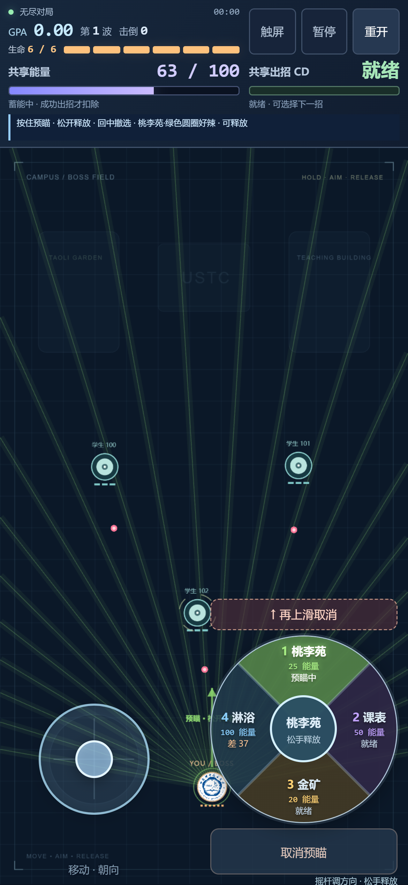

# 科大主题技能名恢复（2026-10-08）

按用户要求恢复原规范中的四个名称：桃李苑·绿色圆圈好辣、选课系统·课表华容道、一教金矿·绩点淘金、期末总评·绩点淋浴。开始介绍保留来源与名称，预瞄、出招反馈和无障碍标签使用完整主题名；局内紧凑按钮和手机转盘显示“桃李苑、课表、金矿、淋浴”。

本次只改显示名称。技能费用仍为 25/50/20/100，效果、共享 CD、长按预瞄、松手释放与取消逻辑均不变。C/Wasm、核心、原规范 PDF 及既有验证记录没有改动。交付物为 `demo/ustc-danmaku.html`，1,199,008 字节，SHA256 `aa6cd1051e8f2f41fe6e383f0bca47db1646efbbcf72ca0cad08660f8467dae0`。

网页构建和单文件生成成功。对新单文件运行已有电脑浏览器检查 282/282、手机浏览器检查 326/326（8 种设备/窗口资料），均通过，无页面运行错误。目视检查横屏、竖屏与 320×568 紧凑手机截图，主题简称清楚、转盘没有文字重叠。这是浏览器模拟验证，不代表实体手机试玩。

- [电脑原始报告](theme-names/desktop-browser.json)
- [手机原始报告](theme-names/mobile-browser.json)
- [交付物、配图及冻结 Wasm 校验](theme-names/integrity.json)

